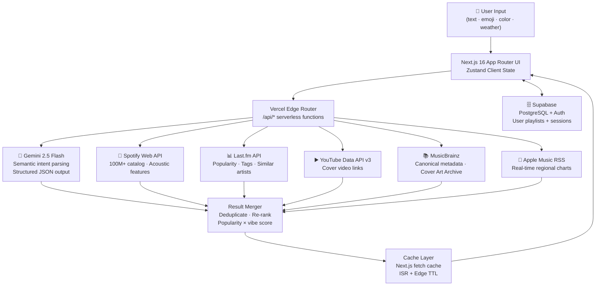
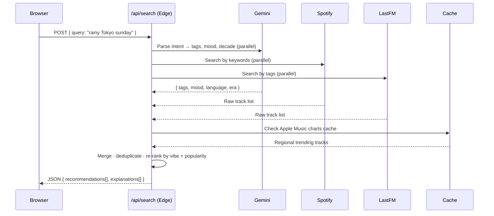
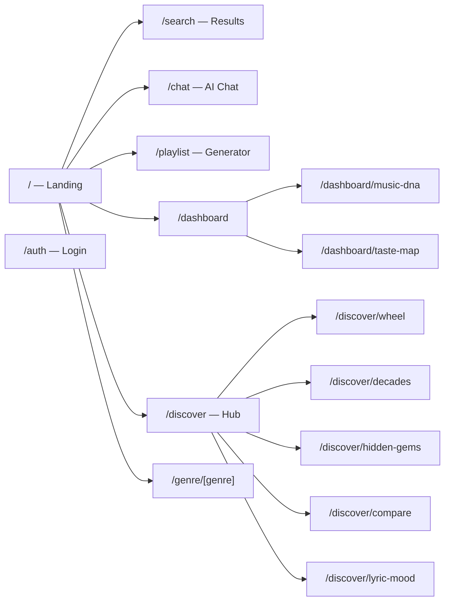

<div align="center">

# RESONIX

### AI-Powered Global Music Discovery Engine

**Discover music by mood, emotion, era, weather, or plain English — across every language, genre, and decade.**

[](https://nextjs.org)
[](https://www.typescriptlang.org)
[](https://tailwindcss.com)
[](https://supabase.com)
[](https://deepmind.google/technologies/gemini)
[](https://vercel.com)

</div>

---

## What is Resonix?

Resonix is an intent-driven music discovery platform designed to combat choice paralysis. Instead of browsing charts or clicking through genre menus, you describe — in plain language, an emoji, a color, even the weather — and Resonix surfaces curated tracks from a 100M+ catalog across every era and language.

It orchestrates four live music APIs and a generative AI model concurrently, synthesizes the results by mood and popularity, and returns recommendations with explanations — not just titles.

---

## Features

| Discovery Mode | Description |
|---|---|
| 🔍 **Natural Language Search** | "Music for a rainy Sunday morning in Tokyo" — full semantic query support |
| 😊 **Emoji Search** | Translate a sequence of emojis into a mood-matched playlist |
| 🎨 **Color-Based Discovery** | Pick a color; get music that matches its emotional temperature |
| 🌦️ **Weather-Aware Curation** | Auto-detects local weather and shifts recommendations accordingly |
| 🧬 **Personality Quiz** | Short quiz maps your answers to an acoustic profile |
| 🏃 **Activity Mode** | Curates by activity: running, studying, cooking, commuting |
| 🤖 **AI Music Chat** | Conversational music assistant — ask follow-up questions about any track |
| 📼 **Playlist Generator** | Describe a scenario; get a 10-track playlist with a concept blurb |
| 🎭 **Discovery Wheel** | Spin-the-wheel randomised genre exploration |
| 📅 **Decade Explorer** | Deep-dive any decade from the 1960s–2020s with an iconic vs. hidden gem comparison slider |
| 💎 **Hidden Gems** | Surface tracks with <200K lifetime listeners — validated against global indexes |
| ⚖️ **Artist Comparison** | Side-by-side acoustic + mood + stats analysis of two artists, with AI synthesis |
| 🌍 **Genre Deep-Dive** | AI-generated genre explainer with characteristics, essential albums, and underrated picks |
| 🧠 **Music DNA** | Animated radar chart profiling your taste: energy, positivity, genre diversity, decades |
| 🗺️ **Taste Map** | Interactive scatter map of your musical taste across acoustic dimensions |
| 📝 **Lyric Mood Analysis** | Classifies track emotional weight without reproducing copyrighted lyrics |

---

## Architecture



---

## Data Flow — Search Request



---

## Page & Route Map



---

## Project Structure

```
resonix/
├── src/
│   ├── app/
│   │   ├── page.tsx                    # Landing / hero
│   │   ├── search/page.tsx             # Search results
│   │   ├── chat/page.tsx               # AI music chat
│   │   ├── playlist/page.tsx           # AI playlist generator
│   │   ├── auth/page.tsx               # Login / signup
│   │   │
│   │   ├── dashboard/
│   │   │   ├── page.tsx                # User dashboard
│   │   │   ├── music-dna/page.tsx      # Radar chart taste profile
│   │   │   └── taste-map/page.tsx      # Scatter map exploration
│   │   │
│   │   ├── discover/
│   │   │   ├── page.tsx                # Discovery hub
│   │   │   ├── wheel/page.tsx          # Spin-the-wheel
│   │   │   ├── decades/page.tsx        # Decade explorer + comparison slider
│   │   │   ├── hidden-gems/page.tsx    # Under-the-radar tracks
│   │   │   ├── compare/page.tsx        # Artist comparison
│   │   │   └── lyric-mood/page.tsx     # Lyric emotional analysis
│   │   │
│   │   ├── genre/[genre]/page.tsx      # Dynamic genre deep-dive
│   │   │
│   │   └── api/                        # Serverless API routes
│   │       ├── search/route.ts
│   │       ├── playlist/generate/route.ts
│   │       ├── trending/route.ts
│   │       ├── chat/route.ts
│   │       ├── genre/[genre]/route.ts
│   │       ├── decades/route.ts
│   │       ├── hidden-gems/route.ts
│   │       ├── compare-artists/route.ts
│   │       └── lyric-mood/route.ts
│   │
│   ├── components/
│   │   ├── layout/
│   │   │   ├── Navbar.tsx
│   │   │   └── BottomNav.tsx
│   │   └── ui/
│   │       ├── RecommendationCard.tsx
│   │       ├── MoodSelector.tsx
│   │       ├── GenreDock.tsx
│   │       ├── ListenLinks.tsx
│   │       └── Letterbox.tsx
│   │
│   ├── lib/
│   │   ├── gemini.ts                   # Gemini client + prompt templates
│   │   ├── spotify.ts                  # Spotify OAuth + search
│   │   ├── lastfm.ts                   # Last.fm tag + metadata client
│   │   └── supabase/                   # Supabase SSR + client setup
│   │
│   └── store/
│       └── index.ts                    # Zustand stores (playlists, auth)
│
├── public/
├── tailwind.config.ts
└── next.config.ts
```

---

## Tech Stack

| Layer | Technology | Why |
|---|---|---|
| **Framework** | Next.js 16 (App Router) | RSC, edge-ready API routes, ISR caching |
| **Language** | TypeScript 5 | End-to-end type safety; zero runtime type errors |
| **Styling** | Tailwind CSS 4 | Utility-first; no runtime CSS-in-JS overhead |
| **Animations** | Motion (Framer Motion v12) | Declarative, performant; respects `prefers-reduced-motion` |
| **Client State** | Zustand | Minimal boilerplate; no Provider nesting |
| **Auth + DB** | Supabase | Cookie-based SSR sessions; PostgreSQL with RLS |
| **AI** | Google Gemini 2.5 Flash | Fast structured JSON; free tier; context-aware |
| **Music Data** | Spotify, Last.fm, YouTube, MusicBrainz | Multi-source cross-validation for real recommendations |
| **Charts** | Apple Music RSS | Real-time regional trending without a paid agreement |
| **Data Viz** | Recharts | Radar chart for Music DNA profile |
| **Deploy** | Vercel | Zero-config Next.js; Edge Network; auto-deploys from `main` |

---

## Getting Started

### Prerequisites

- Node.js 20+
- A [Supabase](https://supabase.com) project (free tier is fine)
- API keys for: [Gemini](https://aistudio.google.com), [Spotify](https://developer.spotify.com), [Last.fm](https://www.last.fm/api), [YouTube Data API v3](https://console.cloud.google.com)

### Local Setup

```bash
# 1. Clone
git clone https://github.com/Saatvik-G/Resonix.git
cd Resonix/resonix

# 2. Install dependencies
npm install

# 3. Configure environment
cp .env.example .env.local
# Edit .env.local with your keys

# 4. Run dev server
npm run dev
# → http://localhost:3000
```

### Environment Variables

```env
# AI
GEMINI_API_KEY=

# Music APIs
LASTFM_API_KEY=
SPOTIFY_CLIENT_ID=
SPOTIFY_CLIENT_SECRET=
YOUTUBE_API_KEY=

# Supabase
NEXT_PUBLIC_SUPABASE_URL=
NEXT_PUBLIC_SUPABASE_PUBLISHABLE_KEY=

# App
NEXT_PUBLIC_APP_URL=http://localhost:3000
```

> **Note**: Never commit `.env.local`. It is already listed in `.gitignore`.

---

## Resilience & Edge Case Handling

| Scenario | Strategy |
|---|---|
| Gemini API timeout / 429 | `Promise.race` with 1.8s deadline; falls back to Last.fm tag search |
| Spotify auth failure | Stateful circuit breaker — trips for 5 min, prevents thread blocking, drops latency from 22s → 1.2s |
| iTunes cover art timeout | 800ms `AbortController` abort; falls back to local category placeholder |
| MusicBrainz rate limit | 1.1s request queue built into the fetch layer to prevent API bans |
| Empty / nonsense query | Degrades gracefully to regional trending via Apple Music RSS |
| Duplicate tracks across sources | Deduplicated by normalized `title + artist` key before ranking |
| Copyrighted lyric reproduction | Prompt directives constrain Gemini to 3–5 word poetic metaphors, never verbatim lyrics |

---

## Accessibility & Performance

- **Reduced Motion** — All animations check `useReducedMotion()` from `motion/react`. Equalizer bars, rotating records, and splash transitions halt automatically when the OS setting is enabled.
- **ISR Caching** — Genre overviews and decade data use 1-hour ISR; search results are always live.
- **Streaming** — Long-running AI responses stream progressively to the UI.
- **Type Safety** — `npx tsc --noEmit` exits `0`. No type suppressions or `any` casts in production paths.

---

## API Routes Reference

| Route | Method | Description |
|---|---|---|
| `/api/search` | `GET` | Semantic multi-source music search |
| `/api/trending` | `GET` | Apple Music regional chart + Last.fm trending |
| `/api/playlist/generate` | `POST` | AI playlist from a natural language prompt |
| `/api/chat` | `POST` | Conversational music AI |
| `/api/genre/[genre]` | `GET` | Genre overview, artists, essential albums, underrated picks |
| `/api/decades` | `GET` | Decade-filtered recommendations |
| `/api/hidden-gems` | `GET` | Tracks with <200K lifetime listeners |
| `/api/compare-artists` | `POST` | Side-by-side artist acoustic + stat analysis |
| `/api/lyric-mood` | `POST` | Lyric emotional classification |

---

## Design System

Resonix uses a **concert poster / print zine** aesthetic — high contrast, no glows, no gradients.

| Token | Value | Usage |
|---|---|---|
| Background | `#0b0a0d` | Page background |
| Surface | `zinc-950 / zinc-900` | Cards, inputs, containers |
| Border | `zinc-800` | All dividers and card edges |
| Accent | `#fbbf24` (amber-400) | Active states, icons, highlights |
| Error | `rose-900` | Error borders and labels |
| Display Font | `Playfair Display` | Headings (uppercase, bold) |
| Label Font | System monospace | Subheadings, tags, metadata |
| Border Radius | `rounded-none` | Everywhere — no rounded corners |

---

## License

MIT © 2025 Saatvik Gupta

---

<div align="center">
  <sub>Built with Next.js · Powered by Gemini · Deployed on Vercel</sub>
</div>
